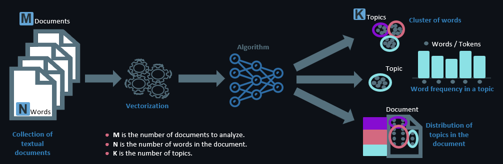

<h1 align="center">NLP: sentiment analysis, text mining, topic modeling & sentiment prediction</h1> 

<p align="center"> 
<a href="https://github.com/lprtk/nlp-amazon-customer-reviews/issues"></a> 
<a href="https://github.com/lprtk/nlp-amazon-customer-reviews/network"></a> 
<a href="https://github.com/lprtk/nlp-amazon-customer-reviews/stargazers"></a> 
<a href="https://github.com/lprtk/nlp-amazon-customer-reviews/"></a> 
</p> 


<p align="center">

</p>


## Table of contents 
* [Content :mag_right:](#Content)
* [Requirements :page_with_curl:](#Requirements)
* [File details :open_file_folder:](#File-details)
* [Features :computer:](#Features) 

<a id="section01"></a> 
## Content 

<p align="justify">This project focuses on why and how we can extract information and value from large volumes of textual data using Natural Language Processing (NLP). Unstructured data is an interesting challenge for any data scientist. The usual rules and conventions of data preparation don't work, it is necessary to perform a thorough text mining in order to bring out all the information hidden behind each word of a text.</p> 

<p align="justify">The interesting thing about NLP and textual data is that it's everywhere. So it is possible to use NLP methods in many different application areas. Here, we will use NLP in a marketing case to better understand our customers and improve their user experience (UX). To do this, we will pretend to be a seller using Amazon as a platform and will work on consumer reviews that we have scraped. For example, we take each review and parse them to retrieve the pseudo, title and content of the review, the rating given, whether the purchase is verified, the date or even the place where the review is posted.</p>

<p align="justify">The objective is to put ourselves in the shoes of a brand that markets its products on Amazon and use NLP to improve the overall customer experience, evaluate our service on Amazon and our image, assess customer satisfaction differently, improve products based on customer reviews or be more available and accessible to customers. To do this, we will use many concepts and methods of Data Science applied to textual data. Our application approach is presented in 5 main streams:</p>
<ul>
    <li>
        Step 1 : Web Scraping
        <ul>
            <li>Collect and create the data schema.</li>
            <li>Parsing customer reviews to enrich the database: extracting title, description, date, time, nickname and rating.</li>
        </ul>
    </li>
</ul>
<ul>
    <li>
        Step 2: Sentiment Analysis and Scoring
        <ul>
            <li>Understand and probe the satisfaction of each customer.</li>
            <li>Scoring the intensity and polarity of feelings from the review description.</li>
        </ul>
    </li>
</ul>
<ul>
    <li>
        Step 3: Text mining and data cleaning
        <ul>
            <li>Text cleaning adapted to the sales domain and to the general content of reviews.</li>
        </ul>
    </li>
</ul>
<ul>
    <li>
        Step 4: Topic Modeling (unsupervised learning)
        <ul>
            <li>To improve availability and speed up response time, reviews can be disassociated and prioritized according to the topic they address.</li>
        </ul>
    </li>
</ul>
<ul>
    <li>
        Step 5: Machine Learning (supervised learning)
        <ul>
            <li>Without reading future reviews, design a robust model to identify the overall sentiment expressed by the customer.</li>
        </ul>
    </li>
</ul>

<a id="section02"></a> 
## Requirements
* **Python version 3.9.7** 


<a id="section03"></a> 
## File details
* **data**
  * This folder contains the data.
* **powerpoint**
  * This folder contains a powerpoint presentation in French of the project.
* **scraping**
  * This folder contains a .ipynb file which contains the code for data scraping on Amzon web site.
* **preprocessing**
  * This folder contains a .ipynb file which contains the code for text cleaning, sentiment analysis and text mining.
* **visualization**
  * This folder contains a .ipynb file which contains the code for data visualization.
* **model**
  * This folder contains two .ipynb files which contains the code for machine learning model (unsupervised and supervised learning).

</br> 

Here is the project pattern: 
```
- project 
    > nlp-amazon-customer-reviews
        > image 
            - topic_modeling.png
        > scraping 
            - web_scraping.ipynb
        > preprocessing
            - text_mining.ipynb
        > visualization 
            - data_visualization.ipynb
        > modeling 
            - topic_modeling.ipynb
            - machine_learning.ipynb
        > data 
            - amzn_customer_reviews.csv
        > powerpoint 
            - ppt_project_fr.pdf
```

<a id="section04"></a> 
## Features 
<p align="center"><a href="https://github.com/lprtk/lprtk">My profil</a> • 
<a href="https://github.com/lprtk/lprtk">My GitHub</a></p>
